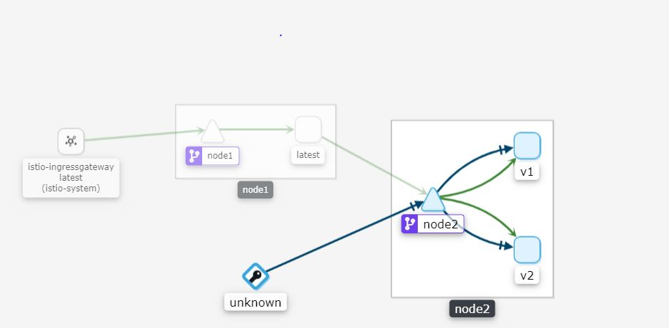
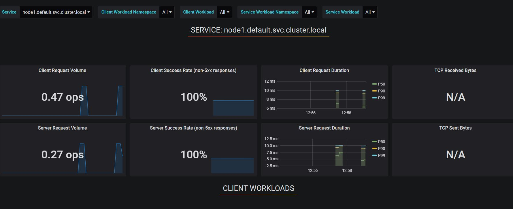
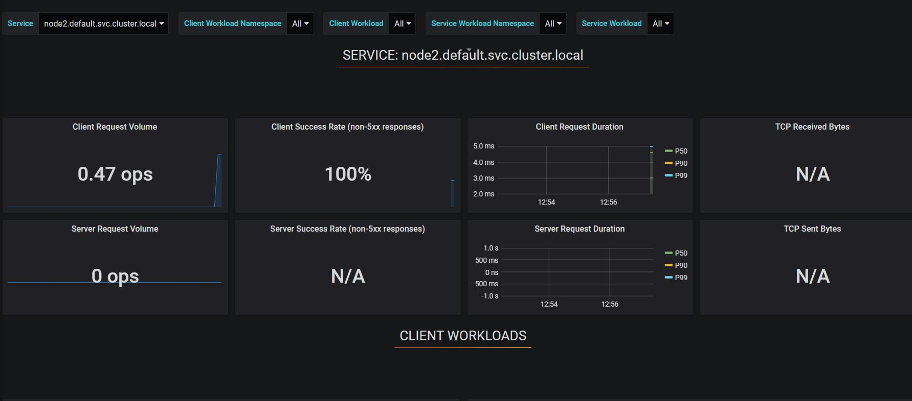

0. instal istio
1. docker build -t node1:v1 -f Dockerfile-node1 .
2. docker build -t node2:v1 -f Dockerfile-node2-v1 .
3. docker build -t node2:v2 -f Dockerfile-node2-v2 .
4. kc -f node1.yaml
5. kc -f node2.yaml
6. kc -f node2-destination-rule.yaml
7. kc -f node-gateway-istio.yaml

8. istioctl dashboard kiali -p 34222
9. dashoabd istio kiali  http://localhost:34222/kiali/console
10. curl localhost/node1   AND  curl localhost/node2
 
## open browser grafana:  
11.kubectl -n istio-system port-forward $(kubectl -n istio-system get pod -l app=grafana -o jsonpath='{.items[0].metadata.name}') 3000:3000 &
12. openbrowser http://localhost:3000/

 

 

 

